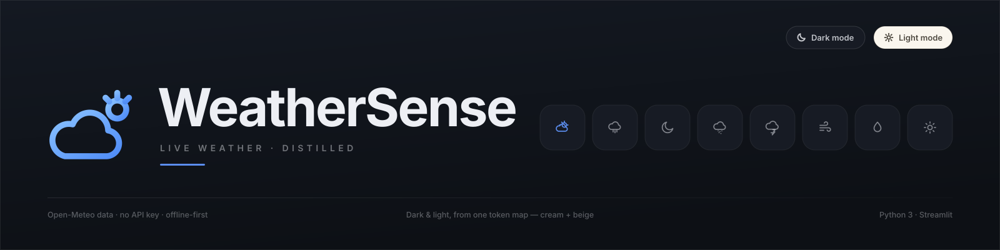
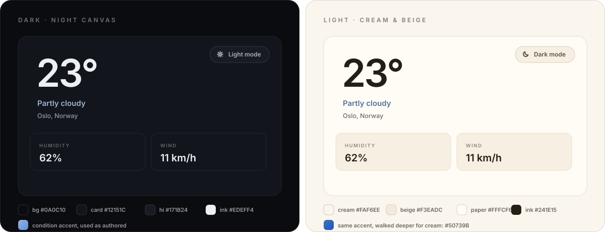

<!--
  Artwork lives in docs/ and is referenced with relative paths so it renders on
  GitHub straight from this repo. If you paste this README somewhere else (a
  blog, a gist, the Streamlit Cloud description), swap the two relative paths
  for the raw URLs:
    https://raw.githubusercontent.com/ssambit635-svg/Weather-sense/main/docs/banner.svg
    https://raw.githubusercontent.com/ssambit635-svg/Weather-sense/main/docs/theme.svg
-->

<p align="center">
  
</p>

<p align="center">
  <b>Live weather, distilled.</b><br>
  Current conditions, a 24-hour rail, a 7-day forecast, air quality, sun path and safety
  alerts for any city on Earth — in a single, quiet, mobile-first screen.<br>
  Built with Python and Streamlit. No API key. No emoji. No blank screens.
</p>

<p align="center">
  <a href="https://weather-sense-kutb55y3djjhmcbymj6wjh.streamlit.app"></a>
  
  
  
  
  
  
</p>

<p align="center">
  <a href="https://github.com/ssambit635-svg/Weather-sense/actions/workflows/tests.yml"></a>
</p>

---

## Contents

- [What it is](#what-it-is)
- [Highlights](#highlights)
- [Dark & light](#dark--light)
- [Features](#features)
- [Quick start](#quick-start)
- [Deploy your own](#deploy-your-own)
- [URL parameters](#url-parameters)
- [Architecture](#architecture)
- [Design system](#design-system)
- [Robustness](#robustness)
- [Caching & performance](#caching--performance)
- [Tests](#tests)
- [Troubleshooting](#troubleshooting)
- [Roadmap](#roadmap)
- [Data & attribution](#data--attribution)
- [Author](#author)
- [License](#license)

---

## What it is

WeatherSense is a genuine weather application, not a static page. It fetches live
conditions, an hourly timeline, a 7-day forecast and air quality from
[Open-Meteo](https://open-meteo.com), resolves your city by name or by IP, and renders
everything in one deliberately quiet screen: hairline grids, tabular numerals, one
condition-driven accent colour, and zero emoji — every glyph is a purpose-drawn SVG.

It also treats failure as a first-class state. A `null` from the API, a dead network, an
old Streamlit or a proxied origin can't blank the page: each one has a designed answer.

<p align="center">
  <a href="https://weather-sense-kutb55y3djjhmcbymj6wjh.streamlit.app"><b>→ Open the live app</b></a>
</p>

## Highlights

| | |
|---|---|
| **Live, not mocked** | Current conditions, 24 hourly slots and 7 days, straight from Open-Meteo — no key, no rate-limit dance. |
| **Dark & light** | A real theme switch: near-black night, or warm cream + beige. One token map drives every surface, and the condition accent is re-tuned for each background. |
| **Search that forgives** | Geocoding with alternate-match suggestions ("Did you mean …"), shareable `?city=` links, one-tap IP location. |
| **Safety first** | Heat, freezing, storm, wind, fog and air-quality alerts derived from live conditions, not a static list. |
| **Air quality** | US AQI, PM2.5 and PM10 with a colour-graded scale and plain-language health guidance. |
| **Sun path** | Sunrise/sunset arc with a live position marker and daylight remaining. |
| **Lifestyle insights** | Stargazing score, mosquito risk and outdoor-sport suitability, computed from temp, wind, humidity, cloud and AQI. |
| **Offline preview** | No network? A generated sample dataset keeps the whole UI demonstrable and labels itself *Offline preview*. |
| **36 regression tests** | Including full end-to-end runs of `app.py` through Streamlit's own test harness. |

## Dark & light

<p align="center">
  
</p>

The **pill in the top-right corner** flips the palette (`Dark mode` ⇄ `Light mode`), and
the choice is written to the URL as `?theme=light`, so a link can open straight into
either look.

- **Dark** — the original night canvas: `#0A0C10` page, `#12151C` cards, hairlines at 7.5%
  white. Condition accents are used exactly as authored.
- **Light** — warm paper: cream page `#FAF6EE`, beige elevation `#F3EADC`, paper cards
  `#FFFCF6`, warm ink `#241E15` at three strengths. No pure white, no cold grey, no pure
  black text.

Because cream is roughly twelve times brighter than near-black, the same accent is
walked down in lightness until it clears a **3.6:1** contrast target against the page —
hue and chroma preserved, so a sunny amber stays amber. Severity colours (good / warn /
bad / AQI bands) are palette tokens too, so alerts, the AQI scale and the insight bars
re-tune with the theme instead of freezing a hex.

```python
from weather_sense.styles import apply_theme

apply_theme("light")                 # repaint the document from the light token map
apply_theme("light", "#5B8DEF")      # …and pin a condition accent
```

To add a third palette, copy `LIGHT` in `weather_sense/styles.py`, adjust the tokens,
and register it in `PALETTES` and `THEMES`. The stylesheet itself never names a colour —
everything reads from custom properties, so nothing else needs to change.

## Features

**Live conditions**
Current temperature, feels-like, condition label with a matching hand-drawn glyph,
today's high/low, cloud cover and pressure — refreshed automatically.

**Next 24 hours**
A horizontally scrollable rail with a temperature sparkline drawn behind the columns,
per-hour precipitation probability and condition icons. Missing samples are interpolated,
never dropped.

**7-day forecast**
Day rows with min→max range bars scaled across the whole week, so you can read the shape
of the week at a glance.

**Conditions grid**
Humidity, feels-like, precipitation, UV index (with a protection hint), visibility and
pressure — plus a compass whose needle points to the wind bearing in degrees, with cardinal
direction and gusts.

**Air quality**
US AQI as a graded value on a colour scale, plus PM2.5 and PM10 in µg/m³ and advice that
changes with the band.

**Sun path**
A dashed arc with the sun's live position, sunrise and sunset times, and daylight
remaining.

**Alerts**
Derived from live values: heat, hard freeze, thunderstorms, high wind and gusts, dense
fog, and unhealthy air — each with a severity colour that follows the theme.

**Saved cities**
Save a city and it appears as a live pill in the favourites rail; temperatures for all
saved cities are fetched **in parallel** and cached for 10 minutes.

**View settings**
A °C/°F pill and a theme pill, both session-backed and rendered as one controls row under
the header.

## Quick start

```bash
git clone https://github.com/ssambit635-svg/Weather-sense.git
cd Weather-sense
pip install -r requirements.txt
streamlit run app.py
```

Open <http://localhost:8501>. Nothing else is required: there is no API key, no database
and no environment variable. The first request resolves your city from your IP address; if
that's blocked, it falls back to a default city and the gazetteer.

<details>
<summary><b>Codespaces / devcontainer</b></summary>

The repo ships a devcontainer. Open it in Codespaces and the app starts on port 8501 with
the port forwarded automatically — the included `.streamlit/config.toml` already makes the
WebSocket handshake work through the proxy.
</details>

<details>
<summary><b>Run the tests</b></summary>

```bash
python -m unittest discover -s tests -v      # or: pytest tests/
```
</details>

## Deploy your own

**Streamlit Community Cloud** — the fastest path:

1. Fork this repository.
2. Go to <https://share.streamlit.io> → *New app*.
3. Pick the repo, set the main file to `app.py`, and deploy.

No secrets are needed. Keep `.streamlit/config.toml` in the repo: it disables CORS/XSRF so
the app opens inside the Cloud iframe (and every other proxy).

**Anywhere else** — a container, a VM, ngrok, a tunnel:

```bash
streamlit run app.py --server.address 0.0.0.0 --server.port 8501
```

## URL parameters

| Parameter | Example | Effect |
|---|---|---|
| `city` | `?city=Tokyo` | Geocodes and opens that city on load. |
| `cc` | `?city=Paris&cc=FR` | Disambiguates between places with the same name. |
| `theme` | `?theme=light` | Opens in light mode (omit for dark). |

Query parameters are also kept in sync as you use the app, so the address bar is always a
shareable link to what you're looking at.

## Architecture

```
app.py                     entry point: splash → bootstrap → shell → dashboard fragment
├── weather_sense/
│   ├── api.py             Open-Meteo clients, payload normalisation, alerts, insights
│   ├── components.py      renderers (splash, hero, rail, forecast, metrics, AQI, sun, …)
│   ├── styles.py          design tokens, both palettes, the whole stylesheet, accent tuning
│   ├── icons.py           stroke icon set + the "sky loop" brand mark (no emoji)
│   ├── compat.py          Streamlit version shims
│   └── sample.py          offline fallback dataset + gazetteer
├── .streamlit/config.toml proxy-safe server config
├── docs/                  banner + theme artwork used by this README
└── tests/                 regression suite (unittest / pytest)
```

One run looks like this:

```
paint palette + intro card        # instant first paint, before any network call
  └─ bootstrap the active city    # ?city= → IP geolocation → default
      └─ first fetch              # the loader animates over this round-trip
          └─ fade the intro out   # one clean screen revealed
              └─ dashboard fragment   # re-renders every 45 s; refetches only on cache miss
```

The intro card is pure CSS — the brand mark traces itself with a normalised
`stroke-dashoffset` animation (`pathLength="1"`), the sun pops in, a two-arc loader spins
under a shimmer bar, and the card fades out when the first dataset lands. It is shown
once per session and collapses to a static logo when the OS asks for reduced motion.

## Design system

- **No emoji, anywhere.** Every glyph — brand mark, weather states, UI icons — is a
  purpose-drawn SVG stroke on a 24×24 grid, so it inherits `currentColor` and follows the
  theme and the condition accent automatically.
- **One accent at a time.** The condition picks it (sunny amber, rain blue, snow ice,
  storm violet); the palette decides how it is rendered.
- **Hairlines, not boxes.** A single 1px line colour separates surfaces; elevation is
  implied by a beige tint in light mode and a lighter card in dark.
- **Tabular numerals.** Temperatures and times line up in columns instead of jittering.
- **Mobile-first.** One column, a 640px max width, a scrollable rail instead of a crowded
  chart.

**Accessibility**

| Concern | How it's handled |
|---|---|
| Colour contrast | Condition accents are auto-tuned per palette (≥ 3.6:1 on cream); body text uses three tested ink strengths. |
| Reduced motion | `prefers-reduced-motion: reduce` disables the splash draw-in, the loader, the drifting hero icon and the halo. |
| Colour scheme | The active palette also sets `color-scheme`, so scrollbars and form controls match. |
| Screen readers | Icons are `aria-hidden`; the mark carries a role and label; nothing relies on colour alone — every severity also has a word. |
| No emoji | Emoji render inconsistently across platforms and read badly aloud; SVG strokes don't. |

## Robustness

The UI must never blank out, so every layer defends itself:

| Failure | Behaviour |
|---|---|
| `null` / string / `NaN` in a payload | `normalize_forecast` rebuilds the response: every key exists, numbers are numbers or `None`, and hourly/daily arrays always line up with `time`. |
| Service unreachable | Cached helpers raise instead of returning junk (Streamlit does not cache exceptions), so a failure is never frozen into the cache; the public wrappers fall back to the sample dataset. |
| No network at all | A cached connectivity probe short-circuits the network path and the app labels itself *Offline preview* — instantly, instead of waiting on three timeouts. |
| Slow API | Every request uses an explicit `(connect, read)` timeout of 4 s / 10 s. |
| Exception inside a fragment | Each fragment renders its own error card with *Retry* and a collapsible traceback — Streamlit's raw red box never appears. |
| Exception anywhere else | A page-level error boundary clears caches, shows the same card, and keeps the rest of the app alive. |
| Old Streamlit | `compat.py` detects capabilities at import time (`width="stretch"` vs `use_container_width`, `st.segmented_control`, `st.fragment`) and degrades instead of dying. |

## Caching & performance

| Call | TTL | Why |
|---|---|---|
| Forecast | 5 min | live enough to trust, cheap enough to auto-refresh |
| Air quality | 5 min | same window as the forecast |
| Geocoding | 24 h | place names don't move |
| IP location | 1 h | your city rarely changes mid-session |
| Saved-city temperatures | 10 min | a rail of favourites, fetched in parallel |
| Connectivity probe | 2 min | keeps the offline path instant |

The dashboard lives in an `st.fragment(run_every=45s)`, so the clock and conditions
re-validate every 45 seconds **without** re-running the whole page — and only the cached
data layer decides when to actually hit the network.

## Tests

```bash
python -m unittest discover -s tests -v      # or: pytest tests/
```

36 tests, no network access required — they run against the offline sample dataset.

| Suite | Covers |
|---|---|
| `TestNormalization` | payload rebuild, the array-truncation regression, `None`/`NaN`/string coercion, AQI normalisation |
| `TestFormatters` | `None` never reaches the UI, wind directions, unit conversion, WMO code defaults |
| `TestPlaces` | place validation (valid, `None`, out-of-range, wrong type) |
| `TestBrand` | SVG validity, unique gradient ids, `pathLength` for the draw-in, favicon data URI, splash states |
| `TestPalette` | cream/beige tokens, dark unchanged, accent tuning keeps the hue and clears contrast, severity colours are palette references, both toggle glyphs resolve |
| `TestCompat` | the stretch shim emits exactly one mechanism |
| `TestAppEndToEnd` | full `app.py` runs: 24 rail cells, 7 forecast rows, 6 metrics, 3 insights, search, favourites, unit pill, theme pill + `?theme=`, `?city=` bootstrap, fragment and page-level error boundaries |

CI runs the suite on Python 3.9, 3.11 and 3.12 (Linux) plus Windows and macOS via
[`.github/workflows/tests.yml`](.github/workflows/tests.yml).

## Troubleshooting

**The app shows an endless "Please wait…" and the log says
`Rejecting WebSocket connection with disallowed Origin or Host header`.**
Streamlit is refusing the WebSocket because the page is served through a proxy host. That
is exactly what the shipped config fixes:

```toml
[server]
enableCORS = false
enableXsrfProtection = false
```

Keep those two flags if you start Streamlit with a custom config, or pass them on the
command line:

```bash
streamlit run app.py --server.enableCORS false --server.enableXsrfProtection false
```

**It says "Offline preview".** This environment can't reach `api.open-meteo.com` or
`ipwho.is`. The UI is showing the generated sample dataset — on a machine with egress it
fetches live data.

**"My location" does nothing.** IP geolocation needs outbound access to `ipwho.is`; search
for a city instead.

**Search finds the wrong city.** Cities are disambiguated with `country_code` from the URL
(`?city=Paris&cc=FR`), and the alternate matches after a search are one click away.

## Roadmap

- Persist saved cities between sessions (they are session-state today)
- Optional unit default and theme default via `?units=f`
- Historical trends for the last 24 hours
- Official alert feeds (Open-Meteo / national services) alongside derived alerts
- Optional `pytest` markers and coverage reporting in CI

Ideas and issues are welcome — see [Contributing](#contributing).

## Contributing

1. Fork the repository and create a branch.
2. Keep the design system intact: use tokens (`var(--…)`) for colour, add icons to
   `icons.py` rather than emoji, and never let a formatter receive a raw `None`.
3. Add a test for anything that can regress — the suite is the reason this app keeps
   working.
4. Run `python -m unittest discover -s tests -v` and open a pull request.

## Data & attribution

Weather and air-quality data by [Open-Meteo](https://open-meteo.com) (CC BY 4.0).
Geocoding by Open-Meteo Geocoding. IP geolocation by [ipwho.is](https://ipwho.is).
WeatherSense is an independent project and is not affiliated with Open-Meteo.

## Author

**Sambit Sway** — Aspiring Cloud & DevOps Engineer · Python Enthusiast · Continuous Learner

[](https://github.com/ssambit635-svg)
[](https://www.linkedin.com/in/sambit-swain-7032a8378)

## License

**Not set yet.** Without a `LICENSE` file the code is technically "all rights reserved".
If you intend to let others use it, drop an `LICENSE` file in the root — MIT is the usual
choice for an app like this and takes about a minute.

---

<p align="center">
  <i>Built with Python and Streamlit. Weather data by Open-Meteo.</i><br>
  <a href="https://weather-sense-kutb55y3djjhmcbymj6wjh.streamlit.app">Live app</a> ·
  <a href="https://github.com/ssambit635-svg/Weather-sense/issues">Issues</a>
</p>
